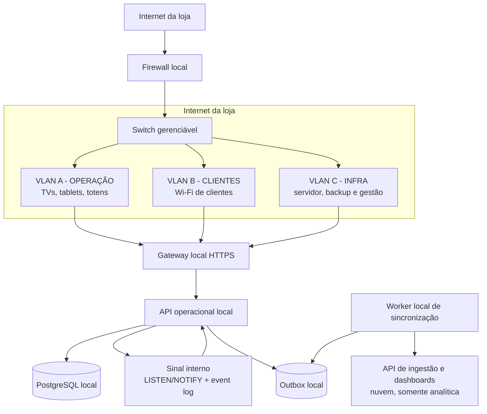

# Infraestrutura técnica local: rede, hardware e software

**Status:** desenho técnico e modelos de implantação preparados  
**Escopo:** a aplicação, o PostgreSQL local, os health checks, os backups e os modelos de serviço já estão implementados; rede física, certificados e instalação definitiva ainda dependem do servidor.

## 1. Decisão fundamental

A comunicação deve seguir este caminho:

```text
dispositivo
  -> rede autorizada
  -> gateway/reverse proxy local
  -> API operacional local
  -> PostgreSQL local
  -> API operacional local
  -> resposta ou evento em tempo real
  -> dispositivo
```

## 2. Topologia proposta



A nuvem aparece nesse desenho em dois papéis diferentes e que não devem ser confundidos:

- **ingestão analítica:** recebe eventos enviados pelo local;
- **dashboard:** consulta os dados analíticos.

O fluxo operacional de uma senha não deve passar pelo banco, API ou dashboard da nuvem.

## 3. Segmentação de rede: camada A e camada B********

Tecnicamente, as camadas A e B devem ser implementadas como **VLANs e SSIDs separados**, com regras de firewall entre elas. Não devem ser apenas dois nomes de Wi-Fi na mesma rede.

### 3.1 VLAN C — infraestrutura

É a rede protegida onde ficam os serviços centrais:

- servidor local;
- PostgreSQL, se estiver em máquina separada;
- backup/NAS;
- firewall, switches e pontos de acesso;
- monitoramento e administração.

Exemplo de endereçamento:

```text
VLAN 10 - INFRA
Rede:      10.50.10.0/24
Gateway:   10.50.10.1
Servidor:  10.50.10.10
Postgres:  10.50.10.11 (somente se estiver separado)
```

### 3.2 VLAN A — operação

É a rede dos equipamentos que precisam operar a fila:

- TVs de chamada;
- tablets de atendentes;
- totens;
- agentes de impressão;
- eventualmente, dispositivos de supervisão.

Exemplo:

```text
VLAN 20 - OPERACAO
SSID:      SENHAHUB-OPERACAO
Rede:      10.50.20.0/24
```

Permissões recomendadas:

- acesso ao gateway local em HTTPS;
- acesso ao DNS e NTP locais;
- acesso à internet somente para atualizações e serviços necessários;
- nenhum acesso direto ao PostgreSQL;
- nenhum acesso à rede de clientes;
- nenhum acesso à administração do firewall ou dos switches.

TVs e totens devem preferencialmente usar Ethernet. Tablets podem usar Wi-Fi com reserva DHCP por dispositivo.

### 3.3 VLAN B — clientes

É a rede para clientes conectados ao Wi-Fi da loja. Ela deve ser tratada como rede não confiável:

```text
VLAN 30 - CLIENTES
SSID:      SENHAHUB-CLIENTES
Rede:      10.50.30.0/24
```

Permissões recomendadas:

- internet normal;
- acesso somente à API local do SenhaHub necessária para o cliente;
- bloqueio de comunicação entre clientes;
- bloqueio para VLAN A;
- bloqueio para VLAN C, exceto HTTPS do gateway local;
- isolamento de cliente no ponto de acesso;
- DNS controlado pelo firewall ou resolutor autorizado.

### 3.4 VLAN opcional — impressão e IoT

Se os totens, impressoras ou outros dispositivos tiverem comportamento pouco confiável, eles podem ser isolados:

```text
VLAN 40 - IOT_PRINT
Rede:      10.50.40.0/24
```

Essa VLAN teria somente acesso às rotas específicas do serviço local. Ela não deve possuir acesso livre à internet nem ao PostgreSQL.

## 4. Regras de firewall

O firewall deve trabalhar com uma política padrão de bloqueio entre VLANs. As permissões precisam ser explícitas.

| Origem | Destino | Porta | Ação |
|---|---|---:|---|
| VLAN A | Gateway/API local | TCP 443 | Permitir |
| VLAN B | Gateway/API local, somente rotas de cliente | TCP 443 | Permitir |
| VLAN A | PostgreSQL | TCP 5432 | Bloquear |
| VLAN B | PostgreSQL | TCP 5432 | Bloquear |
| Internet | PostgreSQL | TCP 5432 | Bloquear |
| Internet | Operação/admin | TCP 443 | Bloquear por padrão |
| Gateway/API | PostgreSQL | TCP 5432 | Permitir somente se estiver em host separado |
| Servidor local | Nuvem de ingestão | TCP 443 | Permitir saída |
| Servidor local | Internet para atualizações | TCP 443/DNS/NTP | Permitir de forma controlada |
| Administração autorizada | Servidor local | SSH/HTTPS de gestão | Permitir somente por VLAN ou VPN administrativa |

O PostgreSQL deve escutar apenas em `localhost` quando estiver no mesmo servidor da API. Se estiver em outro host, deve escutar somente no endereço privado da VLAN C e aceitar conexões do usuário de serviço da API.

## 5. Tempo real da fila

### 5.1 Protocolo para os dispositivos

O protocolo principal deve ser:

- **HTTPS/REST** para comandos e consultas pontuais;
- **Server-Sent Events (SSE)** para notificações do servidor para TVs, tablets e celulares;
- **Web Push** para avisos quando o aplicativo móvel estiver em segundo plano;
- consulta de estado como fallback quando uma conexão SSE estiver indisponível.

SSE é adequado porque a maior parte do fluxo é unidirecional: a API local informa que uma senha foi chamada, que o painel mudou ou que um setor foi atualizado. O padrão também prevê reconexão e o cabeçalho `Last-Event-ID`, que permite ao cliente solicitar os eventos perdidos. [HTML Standard — Server-sent events](https://html.spec.whatwg.org/dev/server-sent-events.html)

WebSocket só deve ser adicionado se surgir uma necessidade real de comunicação bidirecional contínua. Para a fila, ele não é necessário no primeiro desenho.

### 5.2 Como o PostgreSQL participa

O PostgreSQL pode acordar a API local com `LISTEN/NOTIFY`, mas `NOTIFY` não deve ser o armazenamento dos eventos.

Transação de uma chamada:

```text
BEGIN
  UPDATE tickets ...
  INSERT INTO ticket_events ...
  INSERT INTO outbox_events ...
  SELECT pg_notify('queue_changed', 'ticket:123')
COMMIT
```

Depois do commit:

1. a API recebe a notificação;
2. consulta o `event_log` ou `ticket_events` persistido;
3. publica o evento no SSE dos dispositivos autorizados;
4. o worker usa a outbox para enviar uma cópia analítica à nuvem.

O payload do `NOTIFY` deve ser pequeno e funcionar apenas como aviso de que existe algo novo. O conteúdo durável fica em tabela. A documentação oficial do PostgreSQL descreve `LISTEN/NOTIFY` como mecanismo de notificação entre processos e recomenda usar tabelas para transportar dados maiores. [PostgreSQL — NOTIFY](https://www.postgresql.org/docs/current/sql-notify.html)

### 5.3 Recuperação de eventos

Cada evento de tempo real deve ter uma sequência local:

```text
event_id:  uuid
sequence: bigint crescente
scope:    sector|ticket|store|device
type:     ticket.called|ticket.finished|...
payload:  JSON mínimo
```

O cliente mantém o último `sequence` recebido. Quando reconectar:

```text
GET /api/events?since=12345
```

ou utiliza `Last-Event-ID` no SSE. Se a sequência estiver fora da janela de retenção, a API devolve um snapshot completo do estado atual antes de reabrir o stream.

Isso evita que uma queda de Wi-Fi ou reinício da TV deixe a tela em estado antigo.

### 5.4 Regras para não criar atraso

- não fazer polling de todos os dispositivos a cada segundo;
- manter uma conexão SSE por dispositivo, não uma conexão PostgreSQL;
- usar pool de conexões no servidor, dimensionado pelo número de workers da API;
- enviar payloads pequenos e específicos por setor;
- não enviar o estado completo da loja para toda TV;
- usar heartbeat a cada 15–30 segundos;
- reconectar com backoff e jitter;
- manter a transação de emissão/chamada curta;
- nunca executar consultas analíticas pesadas no mesmo caminho da fila;
- separar relatórios e agregações do banco operacional, mesmo que inicialmente rodem no mesmo host.

### 5.5 Metas de desempenho

Estas são metas de engenharia para validar em teste:

| Indicador | Meta inicial |
|---|---:|
| Transação de emissão/chamada no banco local | p95 abaixo de 100 ms |
| Commit local até evento SSE na rede A | p95 abaixo de 300 ms |
| Alteração visível em TV/tablet na rede A | p95 abaixo de 500 ms |
| Reconexão de dispositivo | abaixo de 10 s |
| Conexões PostgreSQL | controladas por pool, não pelo número de telas |

O teste deve medir o tempo entre a confirmação da transação local e a pintura da atualização na tela.

## 6. Hardware local

O volume de dados da fila não exige um servidor muito grande. O ponto crítico é disponibilidade, disco confiável, energia e rede bem segmentada.

### 6.1 Servidor local de produção

| Item | Mínimo aceitável | Recomendado |
|---|---|---|
| CPU | x86-64, 4 núcleos | 6–8 núcleos, classe empresarial |
| Memória | 16 GB | 32 GB, ECC se disponível |
| Banco | 1 SSD de 500 GB | 2 SSDs de 1 TB em espelho/RAID1 |
| Rede | 1 GbE | 2 interfaces 1 GbE ou 2,5 GbE |
| Sistema | Linux Server | Linux Server em máquina dedicada |
| Energia | nobreak | nobreak com USB/rede e desligamento controlado |
| Recuperação | reinício manual | boot automático e serviços supervisionados |

A configuração recomendada não é necessária por causa da quantidade de senhas. Ela existe para suportar logs, backups, retenção de eventos, observabilidade e continuidade 24/7.

Evitar:

- cartão SD ou pendrive como disco do PostgreSQL;
- SSD sem backup e sem espelho quando a operação depender de um único servidor;
- notebook pessoal como servidor definitivo;
- Wi-Fi como enlace principal do servidor;
- banco no mesmo volume sem espaço reservado para WAL e backup temporário.

### 6.2 Rede física

- firewall/roteador com VLAN, DHCP, DNS local e regras de estado;
- switch gerenciável com VLAN 802.1Q;
- cabeamento Cat6 ou melhor para pontos fixos;
- pontos de acesso Wi-Fi 6 com backhaul cabeado;
- PoE para pontos de acesso, se possível;
- servidor, switch e firewall ligados ao nobreak;
- porta de administração em segmento isolado da rede de clientes;
- reserva DHCP para TVs, totens, impressoras e tablets operacionais.

Para TVs, Ethernet é preferível por estabilidade. Para tablets, Wi-Fi 6 na VLAN A. Para clientes, SSID separado na VLAN B com isolamento de clientes. A quantidade de pontos de acesso deve ser definida por área, paredes e densidade de aparelhos, não somente pela velocidade contratada do link.

### 6.3 Backup

O servidor não deve ser o único lugar onde o banco existe. A base mínima é:

```text
PostgreSQL local
  -> backup em segundo disco ou NAS local
  -> cópia criptografada fora do servidor
  -> restauração testada periodicamente
```

O backup deve incluir banco, configuração operacional, certificados, inventário de dispositivos e chaves de recuperação. Segredos não devem ser armazenados junto do backup sem criptografia.

## 7. Software local

### 7.1 Host e serviços

```text
Linux Server
  ├─ firewall/gateway ou firewall dedicado
  ├─ reverse proxy HTTPS
  ├─ API operacional local
  ├─ PostgreSQL
  ├─ serviço de eventos/SSE
  ├─ worker de sincronização
  ├─ serviço do agente de impressão
  ├─ monitoramento e health checks
  ├─ backup PostgreSQL
  └─ sincronização analítica
```

Recomendação inicial:

- PostgreSQL como serviço persistente, com volume próprio;
- API local supervisionada por `systemd` ou por um runtime de containers supervisionado pelo host;
- reverse proxy separado da API;
- configuração fora da imagem e fora do repositório;
- serviço de sincronização separado do processo da API;
- logs estruturados com retenção e rotação;
- `chrony` ou serviço equivalente para relógio consistente;
- monitoramento do disco, memória, CPU, conexões, latência, outbox e idade do último evento.

Não adicionar Redis, Kafka ou outro broker no primeiro servidor sem uma necessidade demonstrada. Para uma única loja e uma API local, PostgreSQL, `LISTEN/NOTIFY`, event log e SSE são suficientes. Um broker passa a fazer sentido quando houver múltiplos nós locais, múltiplas aplicações independentes ou necessidade de retenção de mensagens fora do PostgreSQL.

### 7.2 Usuários do PostgreSQL

O banco deve ter papéis separados:

```text
postgres_admin       -> administração e migrações, nunca usado pela API
senhahub_service     -> operações normais da API
senhahub_sync        -> leitura da outbox e atualização de checkpoints
senhahub_reporting   -> consultas analíticas locais, se necessário
backup_operator      -> execução de backup
```

Cada serviço recebe somente o acesso de que precisa. A API não deve possuir `SUPERUSER`, não deve usar a senha do administrador e não deve executar migrações automaticamente em cada inicialização.

### 7.3 Consultas e conexões

- clientes mantêm conexões HTTPS/SSE com a API;
- somente a API abre conexões PostgreSQL;
- usar pool de conexões com limite explícito;
- definir `statement_timeout` para consultas da API;
- separar consultas de fila de consultas de relatório;
- criar índices para `store_id`, `sector_id`, status e sequências de eventos;
- medir locks e consultas lentas;
- considerar PgBouncer apenas se o número de processos/serviços justificar.

## 8. Fluxos completos

### 8.1 Atendente chama a próxima senha

```text
Tablet na VLAN A
  -> POST HTTPS para API local
  -> API valida usuário, setor e permissão
  -> PostgreSQL executa transação com lock
  -> ticket muda de estado
  -> ticket_event e outbox_event são gravados
  -> NOTIFY é entregue após o commit
  -> API publica SSE para TV, tablet e cliente autorizados
  -> worker sincroniza evento com a nuvem depois
```

A decisão de qual senha chamar ocorre antes da resposta da API e somente no PostgreSQL/API local.

### 8.2 Cliente acompanha na rede da loja

```text
Dispositivo cliente na VLAN B
  -> gateway local
  -> API local
  -> consulta do ticket no PostgreSQL
  -> SSE ou snapshot de acompanhamento
```

O cliente recebe somente o próprio acompanhamento e os dados públicos permitidos.

### 8.3 Dashboard na nuvem

```text
PostgreSQL local
  -> outbox local
  -> worker local
  -> HTTPS para API de ingestão
  -> banco analítico da nuvem
  -> dashboard
```

O dashboard não faz consulta síncrona ao PostgreSQL local. Isso preserva a operação quando a internet cai.

## 9. Critérios de aceite da infraestrutura

Antes de migrar a operação, o desenho deve passar por estes testes:

1. Emitir e chamar senhas com a internet externa desligada.
2. Desligar o Wi-Fi por alguns segundos e confirmar recuperação por `Last-Event-ID`/snapshot.
3. Derrubar a nuvem e confirmar que a outbox cresce sem bloquear a fila.
4. Restaurar a conexão e confirmar sincronização sem duplicidade.
5. Tentar acessar o PostgreSQL a partir das VLANs A e B e confirmar bloqueio.
6. Tentar acessar as rotas de operação a partir da VLAN B e confirmar bloqueio.
7. Reiniciar o servidor e confirmar subida automática de API, banco, eventos e worker.
8. Executar carga com a quantidade esperada de TVs, tablets, totens e clientes simultâneos.
9. Medir p95 de emissão, chamada, commit e atualização visível.
10. Restaurar um backup em um ambiente separado e validar a fila.

## 10. Próximas decisões técnicas

Para transformar este desenho em uma especificação de compra e implantação, ainda precisamos fechar:

1. quantidade de TVs, tablets, totens e impressoras;
2. quantidade máxima de clientes simultâneos na loja;
3. área física, paredes e quantidade de pontos de acesso;
4. capacidade e disponibilidade do link externo para sincronização;
5. espaço físico para servidor, switch, firewall e nobreak;
6. retenção local de eventos e backups;
7. se o banco ficará no mesmo host da API na primeira instalação;
8. janela de manutenção e procedimento de contingência.

## 11. Resumo executivo técnico

```text
PostgreSQL local
  + API local
  + reverse proxy local
  + SSE para tempo real
  + LISTEN/NOTIFY como sinal interno
  + event log e outbox persistentes
  + VLAN A para operação
  + VLAN B para clientes
  + VLAN C para infraestrutura
  + firewall bloqueando acesso direto ao banco
  + nuvem somente para ingestão analítica e dashboards
```

A regra técnica é simples: **dispositivo fala com API; API fala com PostgreSQL; PostgreSQL não fica exposto; nuvem recebe eventos, mas não governa a fila.**
